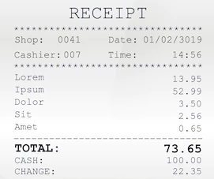
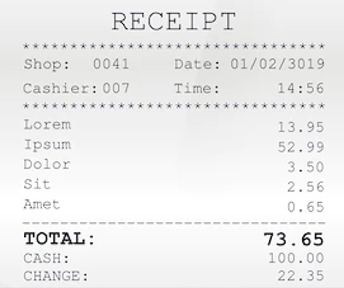

The Aspose.OCR Cloud recognition engine can work with images of any size. However, when recognizing very small images, it may ignore some font detail or incorrectly separate dense lines. Straightforward resizing will not help in these situations, as it will mechanically increase the width and height of the image without actually improving the detail.

Aspose.OCR Cloud offers a smart upsampling algorithm that can increase image resolution and enhance the contrast of text details, greatly improving recognition accuracy.

	
	

<button onclick="triggerSkew(this)">Upsample image</button>

## Usage scenarios

- Increasing text size on medication guides or food labels.
- Improving readability of small images or photos.
