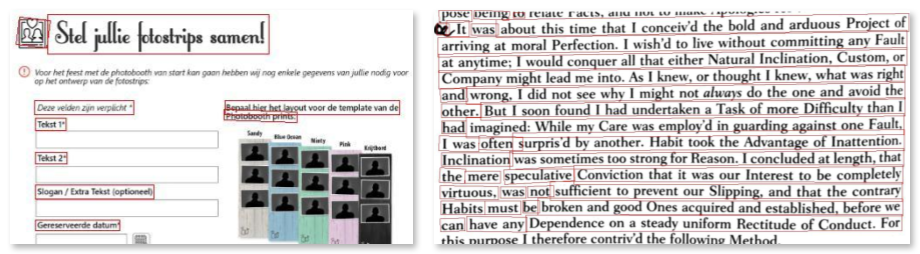
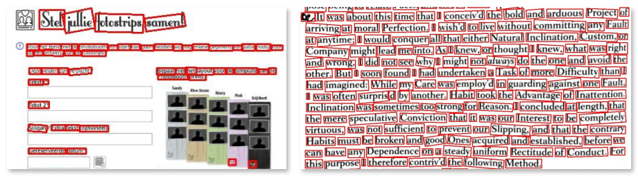

A typical scanned image of a text document may contain a large number of different blocks - text paragraphs, tables, illustrations, formulas, and other layout zones. Detection and categorization of the regions of interest on the page is the cornerstone of OCR process.

Aspose.OCR Cloud offers several document structure analysis algorithms, allowing you to choose the one that works best for your specific content.

{} 
Aspose.OCR Cloud automatically selects the document structure analysis algorithms for you that is suitable for most common cases. However, you can manually override or tune up the default value through the API if you are unhappy with the results or get unwanted artifacts.
{}

Document structure analysis algorithm is specified in an optional [`dsrMode` request parameter](/ocr/dsr-mode/).

## Document Structure Recognition (DSR)

This algorithm breaks the text into smaller blocks, such as lines. These blocks are then recognized and combined into the recognition result.

This algorithm is best suited for recognizing large volumes of formatted text, such as articles with illustrations, newspapers, and the like. It is highly customizable, allowing you to ignore certain regions with textual data, such as logos or stamps.

## Character Region Awareness for Text (CRAFT)

An alternative document structure analysis algorithm that detects individual words within an image and then positions them relative to each other in the recognition result.

It is best suited to recognize images that contain sparse text: invoices, screenshots, driver's licenses, social security cards, government and employment IDs, visas, mathematical formulas, code snippets, and the like. It may also detect small texts, such as handwritten notes, signatures, or stamps. However, this algorithm may be less effective when dealing with large amounts of simple textual data, such as book pages or scientific articles.

## Mixed mode

The combination of DSR and CRAFT layout analysis algorithms. First, the larger blocks of text are detected with DSR and then each of them is additionally processed by CRAFT. This can allow you to handle even the most complex cases such as posters or photographs, but it may consume additional resources and result in unwanted artifacts due to some of the detected areas overlapping each other.
