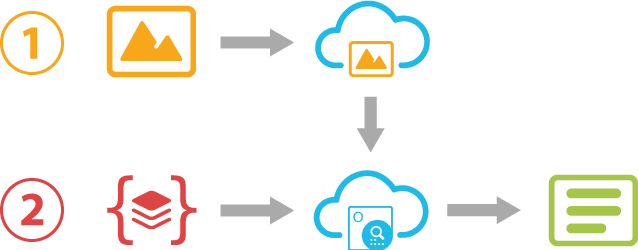

Aspose.OCR Cloud offers several ways to provide an image or PDF file for recognition.

## Through the request body

A binary content of a file that should be recognized is passed to the Aspose.OCR Cloud API in the request body.

- [Recognizing an image from request body](/ocr/recognize-image-from-content/)

## Through the cloud storage

A file that should be recognized is first placed to the cloud storage and then passed to the Aspose.OCR Cloud API by providing the file path and the storage name in the request parameters.

- [Working with cloud storage](/ocr/storage/)
- [Recognizing an image from cloud storage](/ocr/recognize-image-from-storage/)

## From the URL

A file that should be recognized is passed as a link to the web resource. There is no need to download it to your device.

- [Recognizing an image from URL](/ocr/recognize-image-from-url/)
