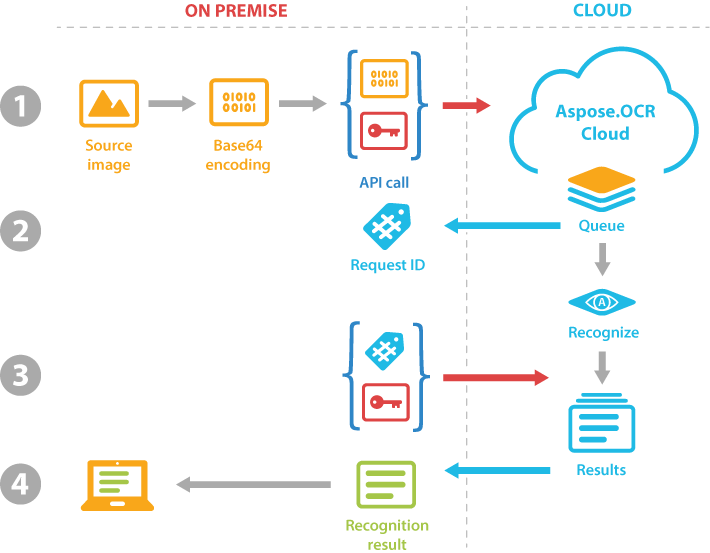

Aspose.OCR Cloud can read even the most complex images or PDF documents with just 2 REST API calls or a few lines of code in any programming language supported by [SDK](/ocr/available-sdks/). Read [Hello, world!](/ocr/hello-world/) article for a hands-on example.

## 1. Submit image for OCR

Aspose.OCR Cloud can read all popular [image formats](/ocr/supported-file-formats/) as well as scanned PDF documents. The image is provided as a _Base64 encoded_ string. You can also specify advanced recognition parameters in the request.

To authorize your requests to Aspose.OCR Cloud API, pass the [access token](/ocr/authorization/) in _Authorization_ header of the request along with the image / PDF.

{} 
If you are using [Aspose.OCR Cloud SDK](/ocr/available-sdks/), you do not have to worry about content encoding, getting an access token, setting request headers, and other technical issues. The SDK will perform all routine operations: from establishing a connection with the Aspose.OCR cloud API to receiving and parsing the response.
{} 

## 2. Get the request ID

Your recognition request is queued and you will receive a unique identifier that can be used to retrieve results or cancel the request.

For more information on what happens in the cloud, read [Behind the scenes](#behind-the-scenes) section.

## 3. Fetch the recognition result

Just call the Aspose.OCR Cloud API with the request ID to retrieve the recognized content and processing status. The recognition may take a second or two, depending on the size of the image and the current Aspose.Cloud load. For more information on what happens in the cloud, read [Behind the scenes](#behind-the-scenes) section.

To authorize your request, pass the [access token](/ocr/authorization/) in _Authorization_ header.

{} 
If you are using [Aspose.OCR Cloud SDK](/ocr/available-sdks/), it will handle all authorization routines.
{} 

It is also possible to get the request status by sending the **GET** request to `https://api.aspose.cloud/v5.0/ocr/Utilities/GetTaskStatus` endpoint with the unique identifier of the task in `id` query string parameter. This method does not return the results, allowing you to save the resources and traffic.

## 4. Process the recognition result

If the OCR process completes successfully, you will get back the recognition results in JSON format along with technical details. Recognized text, audio or file content will be _encoded in Base64_. After decoding, you can save it to disk, display on the screen, analyze, or write to a database.

{}
[Aspose.OCR Cloud SDK](/ocr/available-sdks/) takes care of all the routine operations so you can get content directly with no extra effort.
{}

## Behind the scenes

OCR is a resource-intensive process that involves sophisticated neural networks and complex calculations. Even with high-performance GPU-based servers, this can take some time, especially when reading large images and long PDF documents.

To balance resources under high load and ensure reliable and secure operation, we have introduced _queued processing_. Instead of being immediately sent for recognition, the source image / PDF is placed in a queue under a unique identifier. The queue is constantly monitored and processed in the background using advanced load balancing techniques.

Once the image is recognized, the result is saved to internal storage, from where it can be retrieved using the unique ID within **24 hours** after an OCR request has been made.
