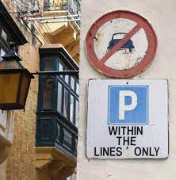
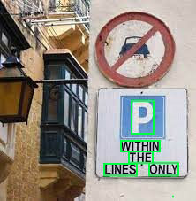

Aspose.OCR Cloud can read text literally from any source: signboards, price tags, plates, food labels and many more. Almost any photo can be converted into text that can be shared, imported into a database, analyzed, sent for automatic translation, and so on.

	

	

	
	<pre>
p
within
the
lines
only		
	</pre>
	

<button onclick="triggerSkew(this)">Read label</button>

{}
Aspose.OCR Cloud API currently supports label recognition in English only.
{}

Label texts are extracted in 3 API calls:

1. [Get access token](/ocr/authorization/)
2. [Send photo for recognition](/ocr/send-label-for-recognition/)
3. [Fetch recognition results](/ocr/fetch-label-recognition-result/)

Because Aspose.OCR Cloud is provided as a REST API, label recognition can be performed from any platform with Internet access.

Aspose also provides open-source [SDKs](/ocr/label-recognition-sdk/) for all popular programming languages, that wrap all routine label recognition operations into a few native methods. It makes interaction with Aspose.OCR Cloud services much easier, allowing you to focus on the task at hand rather than technical details.

{}
Make sure the application has access to the **api.aspose.cloud** domain.
{}
